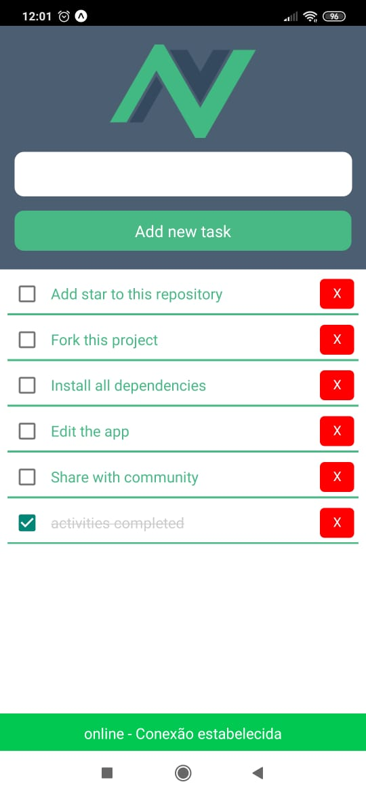
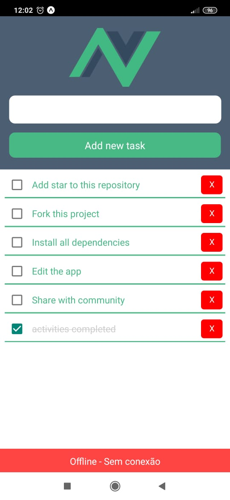

# **SampleTodo-VueNative**
A vue-native project created to test this tool.

## **Installation**
---

- **Clone and install packages**

````
git clone https://github.com/eltonjtoledo/SampleTodo-VueNative.git
cd ./SampleTodo-VueNative
npm install
````
If you have an Android or IOS emulator, run the commands on your terminal.

````
react-native run-android
or 
react-native run-ios
````
You can also use the Expo app to run this project.

## **Screen Recording** 
---
screen recording of basic functions, add, done, undone, and delete activities.


## **Connection status**
---
Displayed when the connection changes status and hides after 3 seconds.




## Some useful links
- [Vue-native documentation](https://vue-native.io)
- [I made some videos about vue-native on my youtube channel in Portuguese.](https://vue-native.io)

